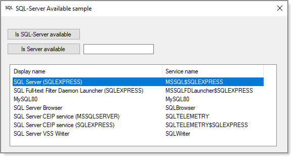

### SQL-Server functions 



# .NET Core

Not compatible, .NET Core 5 missing a package.

This library contains methods to do the following.

- if SQL-Server is available.
- if a named SQL-Server is available.
- if a database exists on a named server.
- If a table exists in a database on a named server.
- Get table names in a database on a named server.

#### Is SQL-Server available
```csharp
var ops = new Utilities();
var result = await ops.SqlServerIsAvailable();

if (ops.IsSuccessFul)
{
    MessageBox.Show($"SQL-Server available: {(result ? "Yes" : "No")}");
}
else
{
    MessageBox.Show(ops.LastExceptionMessage);
}
```
#### Is a specific name server available
```csharp
if (string.IsNullOrWhiteSpace(serverNameTextBox.Text)) return;

var ops = new Utilities();
var result = await ops.SqlServerIsAvailable(serverNameTextBox.Text);

if (ops.IsSuccessFul)
{
    MessageBox.Show($"{serverNameTextBox.Text} is available {(result ? "Yes" : "No")}");
}
else
{
    MessageBox.Show(ops.LastExceptionMessage);
}
```

Note:
> This library does not have a method to determine if the service for SQL-Server is running.

Code such as this can detect if the service is running. Depending on if SQL-Server named instance or SQL-Server Express is used can change the name of the service.
```csharp
var serviceName = "MSSQLSERVER";
var controller = new ServiceController();
try
{
    controller = new ServiceController(serviceName);
    if (controller.Status == ServiceControllerStatus.Running)
    {
        // currently running
    }

}
catch (Exception exception)
{
    // not found
}
```
 
